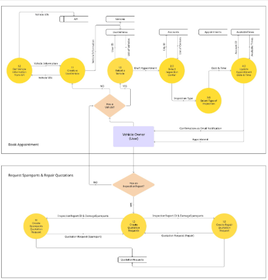
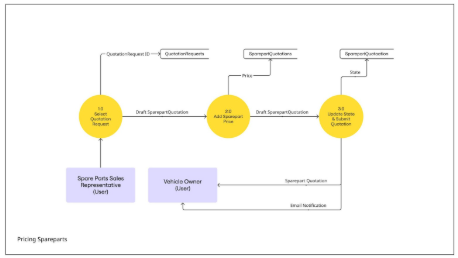
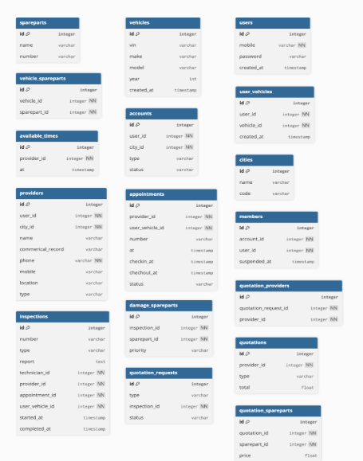
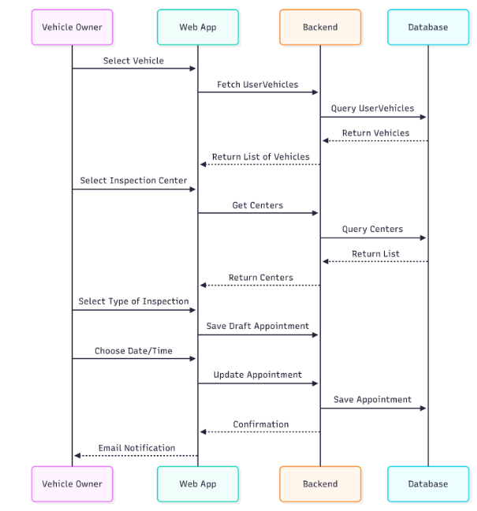

# **Technical Document – Mafhoos System**

---

## **User Stories**

### **Vehicle Owner**
- As a user, I create a new user and register my vehicle.  
- As a vehicle’s owner, I book an appointment to check my vehicle, then receive a report.  
- As a vehicle’s owner, I request a spare parts quotation and/or vehicle repair workshops quotation then receive the requested quotations.  

### **Vehicle Inspection Technician**
- As a vehicle inspection technician, I manage booking requests, and approve appointments or rescheduling them.  
- As a vehicle inspection technician, I submit the vehicle check report with suggested spare parts to be replaced.  

### **Spare Parts Supplier**
- As a spare parts supplier, I apply for a registration request for a spare parts supplier account.  
- As a spare parts supplier, I receive spare parts quotation requests and respond with quotations.  

### **Repair Workshop Estimator**
- As a workshop estimator, I apply for a registration request for a workshop account.  
- As a workshop estimator, I receive workshop quotation requests and respond with quotations.  

---

## **Architecture Diagram**

---

## **Data Flow Diagrams (DFD)**

### **Vehicle Owner**

### **Inspection Technician**

### **Workshop Repair Estimator**

### **Spare Parts Sales Representative**

---

## **Entity Relationship Diagram (ERD)**

---

## **Sequence Diagram**

---

## **API Endpoints**

| **Endpoint** | **Request Type** | **Route** |
|---------------|------------------|------------|
| Create Vehicle Owner | GET / POST | `/register` |
| User Login | GET / POST | `/login` |
| Create New Vehicle View | GET | `/vehicles/create` |
| Create and Store New Vehicle | POST | `/vehicles` |
| List Vehicles | GET | `/vehicles` |
| Create Appointments | GET | `/appointments/create` |
| Store Appointments | POST | `/appointments` |
| Create Inspections | POST | `/inspections` |
| List of Inspections | GET | `/inspections` |
| List Quotation Request | GET | `/inspections/{inspection_id}` |
| Create Quotation Request for Repair | POST | `/inspections/{inspection_id}/quotation-requests/repair` |
| Create Quotation Request for Spare Part | POST | `/inspections/{inspection_id}/quotation-requests/spare-part` |
| View Quotation Request and Submit Price | GET / POST | `/quotation-requests/{quotation_requests_id}` |

> **Base Route:** `https://mafhoos.test`

---

## **SCM Processes**

**Version Control Tool:**  
- Git / GitHub

**Branching Strategy:**
Local Repository (Developer Machine)
↓
Feature Branches (Backend & Frontend for each feature)
↓ (Regular commits)
Development Branch (Development / Testing)
↓ (Pull Request required before merge)
Main Branch (Production)
↓ (High-level PR required before merge)

---

## **QA Processes**

### **Testing Tools**
- **Postman** – for API testing  
- **Pest** – for unit testing  
- **PSR-4** – for PHP code styling standards  

### **Testing Strategy**
- Write **Pest** tests for every feature to ensure correctness and reliability of the business logic.

### **Deployment Pipeline**
- Deploy on **DigitalOcean Droplet** via **Laravel Forge**, ensuring successful deployment and automatic rollback on failure.

